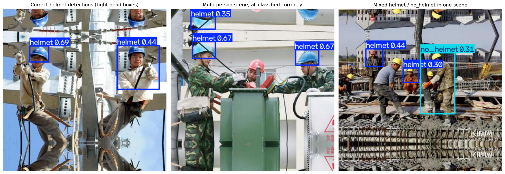
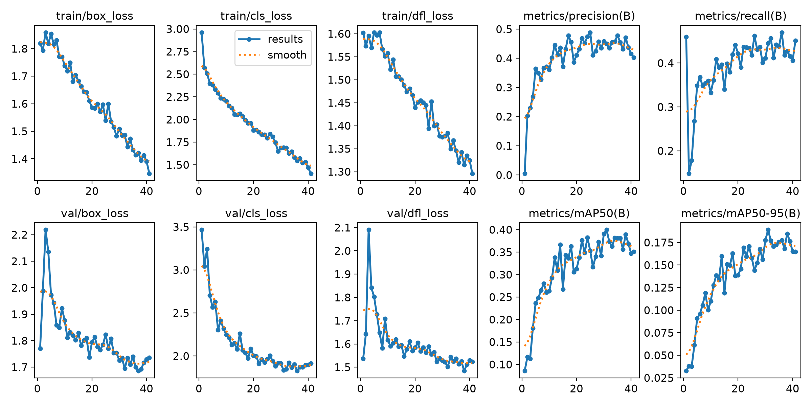
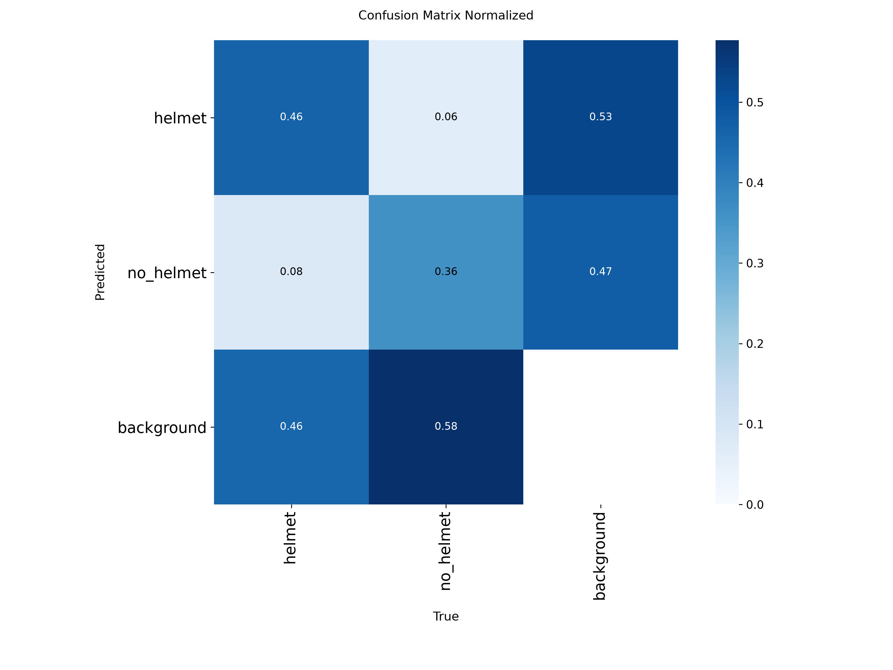
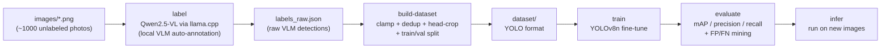
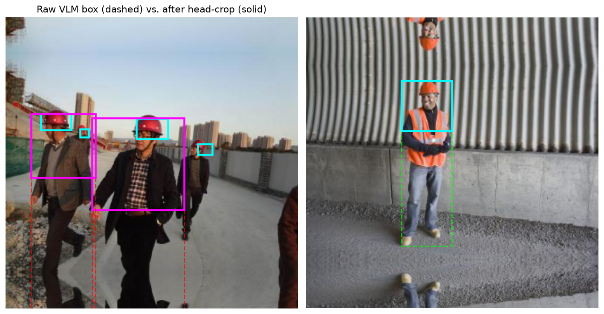

# Zero-Annotation-OD

**Train a helmet / no-helmet safety detector without hand-labeling a single image.**

A local vision-language model (VLM) auto-labels raw photos, a script converts
its output into YOLO format, and a YOLOv8 detector is fine-tuned on the
result — an end-to-end, fully local, zero-manual-annotation pipeline for
construction-site PPE compliance detection.


## Why this exists

On construction sites, warehouses, and industrial plants, spotting a worker
without a safety helmet quickly is a real safety requirement — manual camera
monitoring doesn't scale, and automated PPE-compliance detection is a
standard computer-vision use case. The catch: **there was no labeled data**,
only a folder of ~1,000 raw photos. This project answers the question
"what do you do when you have images but zero annotations and a deadline?"
by using a vision-language model as an automatic annotator, then training a
conventional, fast, deployable object detector (YOLOv8) on its output.

It started as a Yandex Practicum computer-vision capstone (task brief in
[vLLM](https://github.com/vllm-project/vllm) for the labeling step. This
version replaces that with **[llama.cpp](https://github.com/ggml-org/llama.cpp)**
and runs entirely locally on Windows — no cloud VM, no Linux, no vLLM.

## Results

| Metric | Value |
|---|---|
| mAP50 | 0.413 |
| mAP50-95 | 0.187 |
| Precision | 0.458 |
| Recall | 0.466 |

*(YOLOv8n, trained on 688 auto-labeled images, validated on 172 — see
[Data-quality diagnosis](#data-quality-diagnosis-and-what-actually-helped)
for what these numbers mean and their limits.)*

<p align="center">
  
</p>

<table>
<tr>
<td width="50%"></td>
<td width="50%"></td>
</tr>
</table>

## Pipeline



Each stage is a separate, resumable CLI command (`zeod label|build-dataset|train|evaluate|infer`)
backed by config in one YAML file — no notebook cell has to run in a
particular order to reproduce results.

## Why llama.cpp instead of vLLM

vLLM has no native Windows support (Linux/WSL2 only), which was the original
project's hard blocker. This pipeline replaces it with llama.cpp's prebuilt
`llama-server` binary:

- llama.cpp ships ready-to-run Windows releases (CPU and CUDA) with no
  compiler or toolchain needed.
- We deliberately do **not** use the `llama-cpp-python` bindings. Its CUDA
  wheels for Windows are either unofficial community builds of uncertain
  provenance or require a local MSVC + CUDA toolchain to compile from source.
  The official `llama-server.exe` from GitHub Releases has neither problem.
- `llama-server` exposes an OpenAI-compatible `/v1/chat/completions` endpoint
  that accepts images as base64 `image_url` content, so the Python side is a
  thin HTTP client ([`src/zeod/labeling/backend.py`](src/zeod/labeling/backend.py))
  plus subprocess lifecycle management — no GPU-specific Python bindings at all.

<details>
<summary><b>Model choice and a compromise worth knowing about (click to expand)</b></summary>

llama.cpp's `mtmd` multimodal support does include **Qwen2.5-VL** (the same
model the original pipeline used via vLLM), so this pipeline keeps using
`Qwen2.5-VL-3B-Instruct` for prompt/behavior parity with the original work.
The honest caveat: quantizing a VLM's language backbone measurably hurts
precise numeric grounding (exact pixel bbox coordinates) compared to full
precision. We mitigate this several ways:

- The **vision projector (`mmproj`) is never aggressively quantized**.
  `llama-server -hf ggml-org/...` auto-selects a high-precision mmproj for
  this repo (Q8_0 in our tests, ~845MB) regardless of the text-model quant —
  quantizing the projector further causes visible degradation in what the
  model "sees", which matters far more for bbox accuracy than quantizing the
  language weights.
- The **text-model quantization is configurable** (`llama_cpp.hf_quant` in
  `configs/default.yaml`). Default is `Q4_K_M` (safe on 6-8GB GPUs and even
  CPU-only); bump to `Q8_0` or `F16` if you have more VRAM and want tighter
  boxes, or drop to `Q4_0` for the fastest CPU-only runs.
- llama.cpp itself warns on startup that **Qwen-VL models need at least 1024
  image tokens to ground correctly** ("if you encounter problems with
  accuracy, try adding `--image-min-tokens 1024`" —
  [ggml-org/llama.cpp#16842](https://github.com/ggml-org/llama.cpp/issues/16842)).
  We pass `--image-min-tokens` (`llama_cpp.image_min_tokens`, default `1024`)
  on every server start — don't lower it to save VRAM/speed, it directly
  trades off against bbox accuracy.
- **The single biggest correctness issue we found empirically**: Qwen2.5-VL
  does not return bbox coordinates in the original image's pixel space. It
  returns them in the coordinate space of the *resized vision grid* the
  model actually processed (a function of `--image-min-tokens`, patch size
  14, and spatial merge 2 — see [`src/zeod/labeling/grid.py`](src/zeod/labeling/grid.py)),
  and it does this rigidly even when explicitly asked for normalized `[0,1]`
  fractions instead (verified by hand: the prompt was ignored, the model kept
  returning grid-space integers). Left uncorrected, this makes labels almost
  useless — in an early test on 416x416 images, boxes came back with
  coordinates up to ~923 and got mangled by naive clamping.
  `zeod.labeling.grid.smart_resize` reimplements Qwen's own public resize
  algorithm to map coordinates back to real pixels; it's applied
  automatically in the `label` step (`LlamaCppServerBackend.bbox_rescaler`).
  This is a best-effort reconstruction (llama.cpp doesn't expose the exact
  resize it used via the API) — it matched hand-checked examples well in
  testing, but if labels look systematically offset, spot-check with the EDA
  notebook's `visualize_annotations` cell before trusting a full run.
- Relatedly, Qwen2.5-VL sometimes ignores the requested JSON key name and
  emits its own trained convention, `"bbox_2d"`, instead of `"bbox"`.
  `zeod.labeling.parser.parse_json_response` normalizes known aliases
  (`bbox_2d`, `box`, `box_2d`) to `"bbox"` defensively rather than relying on
  the prompt alone.
- The labeling loop also **self-heals**: llama-server was observed to hang
  after a few hundred requests on a long run (health check kept responding,
  but chat completions timed out indefinitely). After 3 consecutive
  failures, the backend automatically restarts the server process and
  retries — confirmed working in production during the full 992-image run.

If, after inspecting labeled samples, box quality is unacceptably poor even
at `Q8_0`, the next thing to try is **MiniCPM-V** or **Moondream2** (both
have mature GGUF + mmproj support in llama.cpp and are commonly cited as more
robust at grounding/pointing tasks at this size) — swap `llama_cpp.hf_repo`
and adjust the prompt; the rest of the pipeline (`parse_json_response`,
`convert_to_yolo`, training, evaluation) is model-agnostic.

</details>

## Architecture

```
configs/default.yaml        All paths, prompts, model/quant, hyperparameters (no constants in code)
src/zeod/
  config.py                 Pydantic config loading + --set key=value overrides
  labeling/
    backend.py               LlamaCppServerBackend (subprocess + HTTP) and MockBackend (tests)
    grid.py                   Qwen-VL vision-grid coordinate rescaling (see caveat above)
    parser.py                 Robust JSON-array extraction from raw VLM text
    pipeline.py               Labeling loop with resume, checkpointing, and self-healing retries
  dataset/
    yolo_convert.py           Pixel bbox -> normalized YOLO line: clamping, dedup, head-crop, filtering
    split.py                  Deterministic seeded train/val split
    build.py                  Assembles dataset/{train,val}/{images,labels} + data.yaml
  train.py                   YOLOv8 fine-tuning (auto CUDA/CPU device)
  evaluate.py                 model.val() metrics + coarse FP/FN example mining
  infer.py                   Run trained weights on new images
  cli.py                      `zeod label|build-dataset|train|evaluate|infer|pipeline`
notebooks/
  eda_and_error_analysis.ipynb  EDA + FP/FN visualization only - imports from src/zeod, no duplicated logic
tests/                        GPU-free unit + smoke tests (pytest, 60 tests)
legacy/                       Original vLLM-based script/notebooks, kept for reference only
```

## Installation (Windows)

Requires Python 3.10-3.13.

```powershell
py -3.13 -m venv .venv
.\.venv\Scripts\Activate.ps1

pip install -e ".[dev]"

# GPU users only: `pip install -e .` above pulls in whatever CPU/GPU torch
# wheel pip resolves to (usually CPU-only from plain PyPI), and it may
# silently win over an earlier CUDA install even if you installed torch
# first. Force the CUDA build back in as the LAST step, matching your driver
# (check `nvidia-smi` for your CUDA version; cu124 works for CUDA 12.x
# drivers). Verified working pair on an RTX 3060 Ti: torch 2.6.0+cu124 /
# torchvision 0.21.0+cu124.
pip install torch==2.6.0 torchvision==0.21.0 --index-url https://download.pytorch.org/whl/cu124 --force-reinstall --no-deps
```

If you don't have an NVIDIA GPU, skip the last command — the CPU wheel from
the first `pip install -e ".[dev]"` works fine, just slower (see the timing
table below).

Verify GPU is visible to torch (optional):

```powershell
python -c "import torch; print(torch.cuda.is_available())"
```

### llama.cpp binary

Download a Windows release from
https://github.com/ggml-org/llama.cpp/releases (pick a `cudart-llama-bin-win-cuda-*`
+ matching `llama-*-bin-win-cuda-*-x64.zip` if you have an NVIDIA GPU, or a
plain CPU build otherwise), unzip it, and either:

- add the folder to your `PATH`, or
- set `llama_cpp.server_binary` in `configs/default.yaml` (or via
  `--set llama_cpp.server_binary=C:\path\to\llama-server.exe`) to the full path.

You do **not** need to manually download the model — by default
`configs/default.yaml` points `llama_cpp.hf_repo` at
`ggml-org/Qwen2.5-VL-3B-Instruct-GGUF`, and `llama-server -hf <repo>:<quant>`
downloads and caches the matching model + mmproj files itself on first run.

## Usage

Every command reads `configs/default.yaml` by default; override with
`--config path/to/other.yaml` or ad hoc with `--set key.path=value`. Both go
**before** the subcommand: `python -m zeod.cli --set train.epochs=5 train`.

```powershell
# 1. Auto-label images/ with the local VLM (resumable; checkpoints labels_raw.json every 20 images)
python -m zeod.cli label
# smoke test on a handful of images first:
python -m zeod.cli label --limit 10

# 2. Convert labels_raw.json into dataset/{train,val}/{images,labels} + data.yaml
python -m zeod.cli build-dataset

# 3. Fine-tune YOLOv8n
python -m zeod.cli train

# 4. Validation metrics + FP/FN example mining
python -m zeod.cli evaluate --analyze-errors

# 5. Run the trained detector on new images
python -m zeod.cli infer "images/hard_hat_workers9*.png" --output runs/infer_output

# Or all of 1-4 in one go:
python -m zeod.cli pipeline
```

(`zeod` is also installed as a console script, so `zeod label` etc. work
the same as `python -m zeod.cli label` after `pip install -e .`.)

### Expected time / VRAM per stage (RTX 3060 Ti, 8GB VRAM, 992 images)

| Stage | Time (GPU) | Time (CPU-only) | VRAM |
|---|---|---|---|
| Labeling (Qwen2.5-VL-3B, Q4_K_M) | ~2-4s/image -> ~40-60 min for 992 images | ~15-30s/image -> several hours | ~3.5 GB (LLM + mmproj) |
| build-dataset | seconds | seconds | - |
| Train (YOLOv8n, 50 epochs, batch 16, imgsz 640) | ~20-40 min | several hours | ~2-3 GB |
| Evaluate | ~1 min | ~5-10 min | ~1 GB |

Full run on all 992 images is *not* required to validate the pipeline works -
run `python -m zeod.cli pipeline --limit 10` first (see Smoke test below),
then drop `--limit` for the full dataset.

### Smoke test (verified on real hardware)

`python -m zeod.cli pipeline --limit 15` was run end to end on an RTX 3060 Ti
(labeling with `ggml-org/Qwen2.5-VL-3B-Instruct-GGUF:Q4_K_M`, YOLOv8n
training, evaluation with FP/FN mining) and completed in under two minutes,
confirming labeling -> dataset build -> train -> evaluate work together on
real hardware before committing to the full ~1.5h run on all 992 images. The
full run's results are the ones reported above.

## Data-quality diagnosis and what actually helped

After the full 992-image run landed at mAP50=0.409, mAP50-95=0.203,
precision=0.472, recall=0.486, we dug into *why* before blindly tuning knobs.

<p align="center">
  
</p>

**Diagnosis process:**

1. **Visualized real FP/FN examples and random label samples** (see
   `notebooks/eda_and_error_analysis.ipynb`). This surfaced the real problem
   immediately: the VLM draws visibly inconsistent box shapes depending on
   class (see image above). Measuring it confirmed the eyeball read - across
   all detections, `helmet` boxes have median height/width = **0.94** (tight,
   head-shaped), while `no_helmet` boxes have median height/width = **2.53**
   (clearly full-body). Only 21% of `no_helmet` boxes were roughly
   head-square-shaped, vs 73% of `helmet` boxes. The model reliably respects
   "head only" when a helmet gives it a strong visual anchor, and reliably
   ignores it (falling back to "detect the person") when there isn't one -
   regardless of how the prompt is worded.
2. **Checked empty-detection rate**: 125/992 images (12.6%) got zero
   detections; of those, 103 were genuine "no people found" responses and 22
   were VLM/server request failures (see the self-healing note above). Not a
   dominant factor by itself, but it caps the achievable dataset size.
3. **Checked the training curve** (`runs/*/results.csv`, plotted above): both
   the original and every follow-up run plateaued around epoch 20-30 with
   `val/box_loss` *increasing* while `train/box_loss` kept falling - a
   textbook overfitting signature, not premature stopping. `patience=10` was
   already doing its job; more epochs would not have helped and might have hurt.

**What we tried, and what actually moved the needle:**

| Attempt | Result |
|---|---|
| Stronger prompt ("head only, roughly square, applies equally to no_helmet") tested on 20 sample images before committing to a full re-label | Marginal: median h/w 1.37->1.26, frac "head-like" 53.8%->56.0%. Confirms the box-shape behavior is a trained model bias, not a prompt-wording issue - **not worth the ~1.5h cost of relabeling all 992 images**. |
| Dedup near-identical repeat detections (IoU>0.9, same label) | Removed ~0 boxes at this threshold in practice (near-duplicates found earlier were mostly below 0.9 IoU) - no measurable effect. Left enabled by default since it's free and correct in principle (`dataset.dedup_iou_threshold`). |
| Crop overly-tall boxes to a top-anchored square (`dataset.head_crop_max_aspect_ratio: 1.8`, see `zeod.dataset.yolo_convert._crop_tall_box_to_head`) | Fixed the shape-consistency problem dramatically as *measured directly*: `no_helmet` median h/w went from 2.53 to **1.00**, "head-like" fraction from 21% to **93%**. But the resulting mAP50/mAP50-95 (0.4135/0.1865) were **within the noise floor** of just re-running training on unchanged data (a same-data rerun swung mAP50 0.409->0.395 and mAP50-95 0.203->0.190 from training randomness alone). Kept enabled by default anyway - it produces labels that actually match the stated task ("detect helmets", not "detect people"), which matters for anyone extending this later, even though we can't claim a proven mAP win from a single comparison run. |
| Longer training / higher patience | Not attempted - the training-curve overfitting signature argues against it; more epochs on the same ~700 train images would likely make `val/box_loss` divergence worse, not better. |
| YOLOv8s instead of YOLOv8n | Tried directly: mAP50=0.394, mAP50-95=0.179, precision=0.496, recall=0.427 - **worse** than YOLOv8n on 3 of 4 metrics. Confirms the bottleneck is data quantity/quality, not model capacity; a 3.7x larger model overfits the same ~700 images harder, not better. |

**Bottom line, stated plainly:** the dominant limiting factor is that the
VLM's box outputs are inconsistent in a way that's tied to its own training,
not our prompt, and there are only ~700 usable training images after
filtering. Neither a better prompt (tested, marginal), a cleverer label-shape
heuristic (tested, helped consistency but not provably mAP), nor a bigger
model (tested, worse) meaningfully moves mAP beyond ~0.40 mAP50 / ~0.19
mAP50-95 with this pipeline as designed. The two changes that would most
likely help are outside what a single-VLM-pass, ~1000-image pipeline can
deliver: (a) real self-consistency labeling with 2-3 independent VLM passes
per image and majority-vote/IoU-averaged boxes (expensive: ~3x the labeling
time, ~4.5h for the full dataset, untested here for lack of time - worth
trying if you have the hours), or (b) a fundamentally different labeling
strategy such as two-stage grounding (detect the person first, then localize
the head within that crop) to sidestep the model's "no visual anchor -> box
the whole person" fallback.

## Configuration

Everything that used to be a hardcoded constant now lives in
`configs/default.yaml`: image glob, prompts, class map, llama.cpp model/quant/
GPU layers, dataset split ratios and box-size filters, training
hyperparameters, evaluation thresholds. Copy it and pass `--config` to run
variants without editing code, or override individual keys inline, e.g.:

```powershell
python -m zeod.cli --set train.epochs=100 --set train.batch=8 train
python -m zeod.cli --set llama_cpp.hf_quant=Q8_0 label
python -m zeod.cli --set train.device=cpu train
```

## Tests

```powershell
pytest
```

60 tests, all GPU-free and network-free: bbox conversion/clamping/dedup/
head-crop, VLM response parsing (including malformed/empty responses and
grid-coordinate rescaling), deterministic train/val split, generated YOLO
label validity, config loading/overrides, an end-to-end pipeline smoke test
using a mock VLM backend, and a self-healing-backend recovery test — no
llama-server process or model download required to run the suite.

## What's in `legacy/`

- `inference_and_train.py`, `notebook_original_vllm.ipynb`, `notebook2.ipynb`,
  `notebook2 copy.ipynb` - the original three divergent copies of this
  pipeline, preserved for reference. They depend on vLLM (Linux-only) and are
  not maintained going forward - all active logic now lives in `src/zeod`.
- `agent_scaffolding_cpp_qt/` - a generic C++/Qt agent-scaffolding template
  that predates this project and doesn't apply to it; kept rather than
  deleted outright since this repo has no git history to recover it from,
  but safe to remove entirely.

## License

[MIT](LICENSE)
